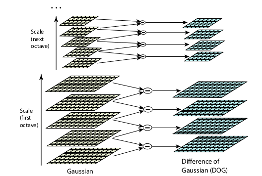
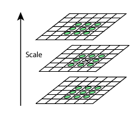

---
title:
- Scale Invariant Feature Transform (SIFT)
theme:
- Luebeck
fontsize:
- 8pt
---

# Scale Invariant Feature Transform (SIFT)

* Metoda izvlačenja invarijantnih osobina (features) slika u svrhu pouzdanog poklapanja slika objekata
* Svojstva su invarijantna u odnosu na veličinu slike (skaliranje), rotaciju
  * Delimično invarijantna u odnosu na promenu osvetljenja i promenu tačke posmatranja u 3D prostoru
* Svojstva su u velikoj meri karakteristična
  * Jedno svojstvo se sa velikom verovatnoćom može uspešno poklopiti sa velikim brojem svojstava na drugim slikama
* Koristi se i za prepoznavanje objekata.
  * Poklapaju se svojstva u odnosu na bazu podataka već poznatih objekata korišćenjem k-NN algoritma
  * Potom se primenjuje Hafova transformacija radi indetifikovanja klastera koji pripadaju određenom objektu 

# Koraci u generisanju svojstava slike

1. Odabir ekstremnih tačaka kao kandidata u *scale-space*
   * *Scale*
   * *Difference-of-Gaussians (DoG)*
2. Lokalizacija ključnih tačaka
   * Biraju se od kandidata na osnovu svoje stabilnosti - ispituju se lokacija, *scale*, kontrast
3. Dodela orjentacije ključnim tačkama
   * Dodeljuje se jedna ili više na osnovu lokalnih svojstava slike
   * Sve buduće operacije se izvode u odnosu na poziciju, *scale* i orjentaciju svake osobine
   * Ovime se dobija invarijantnost u odnosu na pretodno pomenute transformacije
4. Deskriptor ključnih tačaka
   * Mere se gradijenti sa slike u okolini svake ključne tačke na određenom *scale*-u i transformišu se u novu reprezentaciju kojadopušta promenu u osvetljenosti i distoržiji oblika

* Generiše se veliki broj osobina
* Ovo je bitno u slučaju detektovanja malih objekata na slikama sa prezasićenim pozadinama gde je neophodno da se poklope 3-6 osobina kako bi se objekat uspešno poklopio

# Kratak opis

Poklapanje slika i prepoznavanje objekata na slikama

* Svojstva se ekstrahuju iz skupa referentnih slika i čuvaju u bazi podataka
* Nova slika se testira na poklapanje tako što se pojedinačno poredi svako njeno svojstvo sa onima u bazi u odnosu na euklidsko rastojanje njihovih vektora svojstava
* Deskriptori ključnih tačaka su u velikoj meri karakteristični što dovodi do velike verovatnoće da se jedna osobina poklopi sa njoj odgovarajućom u veikoj bazi podataka
* Problem na prezasićenim slikama, dosta osobina neće moći da se poklopi, dosta pogrešnih poklapanja svojstava pored onih ispravnih
* Ispravna poklapanja se filtriraju identifikacijom podskupa koji se poklapanju po lokaciji, *scale*-u i orjentaciji
* Verovatnoća da se osobine slučajno poklapaju po gore navedenim svojstivima je dosta niža nego da se pogrešno poklope

# Detektovanje ekstrema u *scale-space*

Detektovanja ključnih tačaka 

***Scale-space*** slike se definiše kao funkcija L, gde je I ulazna slika:
$$L(x, y, \sigma) = G(x, y, \sigma) * I(x, y)$$
Operator * predstavlja operaciju konvolucije
Gausova funkcija kao *scale-space* kernel $$G(x, y, \sigma) = \frac{1}{2\pi\sigma^2}e^{\frac{-(x^2+y^2)}{2\sigma^2}}$$
Razlika Gausovih funkcija sa konvolucijom slike:

$$D(x, y, \sigma) = (G(x, y, k\sigma) - G(x, y, \sigma)) * I(x, y)$$
$$D(x, y, \sigma) = L(x, y, k\sigma) - L(x, y, \sigma)$$

DoG predstavlja aproksimaciju Laplasijana Gausove funkcije $\sigma^2\nabla^2G$

Pokazano je da za invarijantnost u *scale* je neophodna normalizacija Laplasijana $\sigma^2$ faktorom

# Detektovanje ekstrema u *scale-space* (nastavak)

# Detektovanje ekstrema u *scale-space* (nastavak)

# Precizna lokalizacija ključnih tačaka?

Eliminisanje tačaka sa niskim kontrastom

Tejlorov razvoj funkcije $D(x, y, \sigma)$ radi računanja interpolisane lokacije ključne tačke
$$D(x) = D + \frac{\partial D^T}{\partial x}x + \frac{1}{2}x^T\frac{\partial^2D}{\partial x^2}x$$

Gde se D i njeni izvodi računaju u ključnoj tački a $x = (x, y, \sigma)^T$ je pomeraj u odnosu na ključnu tačku

Lokacija ekstremuma se određuje iz izvoda funkcije u odnosu na $x$, postavljajući ga na nulu:
$$\hat{x} = -\frac{\partial ^2D^{-1}}{\partial x^2}\frac{\partial D}{\partial x}$$ 

Vrednost funkcije u ekstremu može biti korisna radi eliminisanja nestabilnih ekstrema sa niskim kontrastom:
$$D(x) = D + \frac{1}{2}\frac{\partial D^T}{\partial x}\hat{x}$$

# Eliminisanje tačaka duž ivica

Glavne krivine*(Princlpal curvature)* se računaju 2x2 Hesijanom:

$$H = \begin{bmatrix}D_{xx} &  D_{xy} \\ D_{yx} & D_{yy} \end{bmatrix}$$

Sopstvene vrednosti $H$ su proporcionalne glavnim krivinama $D$

$$Tr(H) = D_{xx} + D_{yy} = \alpha + \beta$$
$$Det(H) = D_{xx}D_{yy} - (D_{xy})^2 = \alpha\beta$$

<!---
_x
--->

Neka je r odnos veče i manje magniture sopstvene vrednosti, $\alpha = r\beta$

$$\frac{Tr(H)^2}{Det(H)} = \frac{(\alpha + \beta)^2}{\alpha \beta} = \frac{(r\beta + \beta)^2}{r\beta ^2} = \frac{(r+1)^2}{r}$$

Korišćeno $r = 10$, eliminišu se tačke sa odnosom glavnih krivina večim od 10

# Dodeljivanje orjentacija i magnitude

Dodavajuči orjentaciju svakoj ključnoj tački, deskriptor se može predstaviti u odnosu na tu orjentaciju i tako imati invarijantnost u odnosu na rotaciju slike

$$m(x, y) = \sqrt{(L(x+1, y) - L(x-1, y))^2 + (L(x, y+1) - L(x, y-1))^2}$$
$$\theta (x, y) = tan^{-1} \frac{(L(x, y+1) - L(x, y-1))^2}{(L(x+1, y) - L(x-1, y))^2} $$

* Histogram orjentacija se pravi od orjentacija gradijenata uzoraka u oblasti oko ključne tačke
* Histogram ima 36 podeljaka koji pokrivaju 360 stepeni
* Svaki uzorak je pomnožen sa svojom magnitudom kao i sa kružnom okolinom na koju je primenjena Gausova funkcija gde je $\sigma$ 1.5 veća u odnosu na *scale* trenutne ključne tačke
* Vrhovi u histogramu odgovaraju dominantnim pravcima lokalnih gradijenata
* Detektuje se vrh u histogramu kao i ostali vrhovi u okviru od 80% i time se kreira ključna tačka sa tom orjentacijom

# Deskriptor slike

* Kreira se tako što se prvo računaju magnitude gradijenata i orjentacija pri svakom uzorku u okolini ključnih tačaka
* Na njih se primeni Gausova funkcija označena kružnicom na slici
* Uzorci se potom skupljaju u okviru orjentacionih histograma koji akumuliraju sadržaj u okviru 4x4 podregiona
* Dužina svake strelice označava sumu magnituda gradijenata koji su bliski tom pravcu u okviru regiona

* Deskriptor obrazuje vektor svih vrednosti iz orjentacionog histograma, koje odgovaraju dužinama strelica
* 4x4 niz histograma sa 8 orjentacija u svakom od njih

# Primena u prepoznavanju objekata

* Može se vršiti prepoznavanje svake ključne tačke tako što je poredimo sa tačkama iz baze podataka ekstrahovanih iz trening slika
* Dosta bolji rezultat se dobija porređenjem skupa tačaka(klastera) od barem 3 ključne tačke

* Najbolji kandidat se može identifikovati tako što uzmemo iz baze trening slika najbližeg suseda
* Dosta svojstava iz slike neće imati nijedno ispravno poklapanje u trening bazi podataka
  * Nisu detektovana u trening slikama
  * Nastala su kao rezultat mutne pozadine npr.
* Može se koristiti drugi najbliži sused u ovu svrhu

<!---
pandoc -t beamer [infile.md] -o [outfile.pdf]
--->

